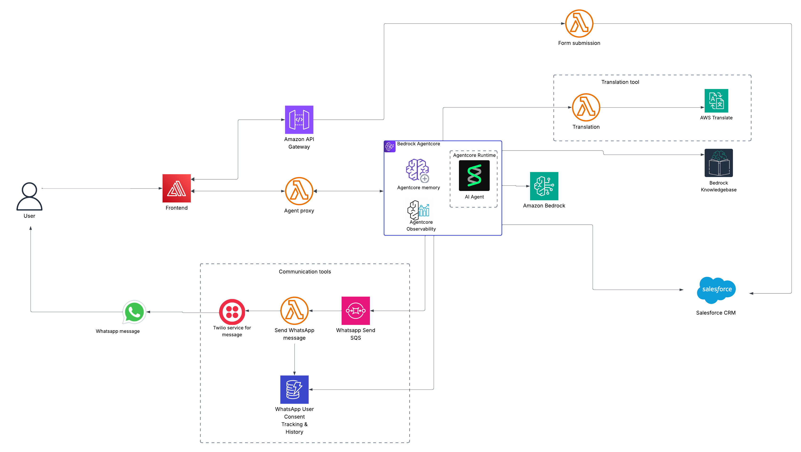

# AI-Admissions Agent 

An AI agent for admissions that combines **AWS Bedrock AgentCore** with a modern **Next.js frontend** to provide an AI-powered conversational experience for prospective students. The system integrates Salesforce CRM, WhatsApp messaging via Twilio, and AWS services to deliver a seamless admissions counselor experience that understands student needs, answers questions, and facilitates advisor connections.


---

## Table of Contents

| Index                                                       | Description                                                    |
| :---------------------------------------------------------- | :------------------------------------------------------------- |
| [High-Level Architecture](#high-level-architecture)         | System architecture overview with component interactions       |
| [Key Features](#key-features)                               | Core capabilities and functionality                            |
| [Directory Structure](#directory-structure)                     | Repository directory organization                              |
| [Getting Started](#getting-started)                         | Quick start guide                                              |
| [Deployment](#deployment)                                   | How to deploy the solution                                 |
| [Modification](#modification)                             | Adapting for different universities                            |
| [Credits](#credits)                                         | Contributors and acknowledgments                               |
| [License](#license)                                         | Project license information                                    |

---

## High-Level Architecture

The following architecture diagram illustrates the various services and components that make up the solution. The agent uses custom tools to retrieve university information, manage conversations, update Salesforce CRM, and trigger WhatsApp follow-ups. For an in-depth explanation of the backend, please look at the [Architecture Deep Dive](./docs/architectureDeepDive.md).




---

## Key Features

- **Intelligent Chatbot**: Conversational AI agent (Nemo) that understands context and builds rapport with prospective students
- **Knowledge Base Access**: Instant answers to program, admission, and university questions
- **CRM Integration**: Automatic lead creation and updates in Salesforce for admissions staff
- **WhatsApp Follow-Up**: Automated follow-up messages via WhatsApp for convenience
- **Multi-Language Support (coming soon)**: Infrastructure will support multiple languages using AWS Translate (70+ languages) for translation.


## Directory Structure

```
AI-Powered-Admissions-Agent/
├── Backend/
│   └── admissions-ai-agent/          # AWS CDK Infrastructure
│       ├── bin/
│       │   └── admissions-ai-agent.ts    # CDK app entry point
│       │   
│       ├── lib/
│       │   └── amplify-hosting-stack.ts       # Amplify Hosting Stack
│       │   └── admissions-ai-agent-stack.ts    # Admissions AI Agent Stack
│       │   
│       ├── lambda/
│       │   ├── agent-proxy/                # Node.js Lambda (streaming agent responses)
│       │   ├── form_submission.py          # Salesforce lead creation
│       │   └── send_whatsapp_twilio.py     # WhatsApp via Twilio
│       │   
│       ├── AgentCore/                      # Bedrock AgentCore Agent
│       │   ├── nemo_agent.py              # Main agent definition
│       │   ├── tools/                      # Custom agent tools
│       │   │   ├── retrieve_tool.py       # Knowledge base retrieval
│       │   │   ├── salesforce_tools.py    # CRM integration
│       │   │   ├── whatsapp_twilio_tool.py # WhatsApp messaging
│       │   │   ├── advisor_handoff_tool.py # Advisor handoff workflow
│       │   │   └── session_utils.py       # Session management
│       │   └── requirements.txt           # Python dependencies
│       │   
│       ├── salesforce-layer/              # Lambda layer for Salesforce
│       ├── twilio-layer/                  # Lambda layer for Twilio
│       ├── package.json                   
│       └── tsconfig.json                  
│
├── mapua-new-frontend/                    # Next.js Web Application
│   ├── app/                               # Next.js App Router
│   │   ├── page.tsx                      # Homepage
│   │   └── layout.tsx                    # Root layout
│   │   
│   ├── components/
│   │   ├── nemo/                         # Chatbot UI components
│   │   └── ...
│   │                          # Other components
│   │   ├── ui/                           # Reusable UI components
│   │   ├── inquiry-form.tsx              # Lead capture form
│   │   └── mapua-landing-page.tsx        # Main landing page
│   │   
│   ├── lib/                              
│   ├── public/                           
│   └── package.json                      
│
├── deploy-scripts/
│   └── frontend-amplify-deploy.sh        # Automated frontend deployment
│
├── docs/                                 # Documentation
│   ├── architectureDeepDive.md
│   ├── deploymentGuide.md
│   ├── userGuide.md
│   ├── APIdoc.md
│   ├── modificationGuide.md
│   └── media/                            # Images and diagrams
│
├── LICENSE                               # MIT License
└── README.md                             # This file
```

### Key Directories Explained

1. **Backend/cintana-admissions-agent/** - Contains all AWS infrastructure code (CDK), Lambda functions, and the Bedrock AgentCore agent implementation
2. **Backend/.../AgentCore/** - The AI agent (Nemo) with custom tools for retrieval, Salesforce, WhatsApp, and advisor handoff
3. **Backend/.../lambda/** - Three Lambda functions: agent proxy (streaming), form submission (Salesforce), and WhatsApp messaging (Twilio)
4. **mapua-new-frontend/** - Next.js application with university website and integrated chatbot UI
5. **deploy-scripts/** - Automation scripts for deploying frontend to AWS Amplify
6. **docs/** - Comprehensive documentation for architecture, deployment, usage, API, and modification

---

## Deployment
To deploy this solution, please follow the steps laid out in the[Deployment Guide](./docs/deploymentGuide.md).

---

## Modification

For detailed customization instructions, see the [Modification Guide](./docs/modificationGuide.md).

---

## Credits

This application was architected and developed by <a href="https://www.linkedin.com/in/loveneet-singh-6bb2851ba/" target="_blank">Loveneet Singh</a>, <a href="http://www.linkedin.com/in/pshristi" target="_blank">Shristi Pathak</a>, and <a href="https://www.linkedin.com/in/apoorv16/" target="_blank">Apoorv Singh</a>, with solutions architect <a href="https://www.linkedin.com/in/arunarunachalam/" target="_blank">Arun Arunachalam</a>, program manager <a href="https://www.linkedin.com/in/thomas-orr/" target="_blank">Thomas Orr</a>  and product manager <a href="https://www.linkedin.com/in/rachelhayden/" target="_blank">Rachel Hayden</a>. Thanks to the ASU Cloud Innovation Centre Technical and Project Management teams for their guidance and support.

---

## License

This project is distributed under the [MIT License](./LICENSE).
