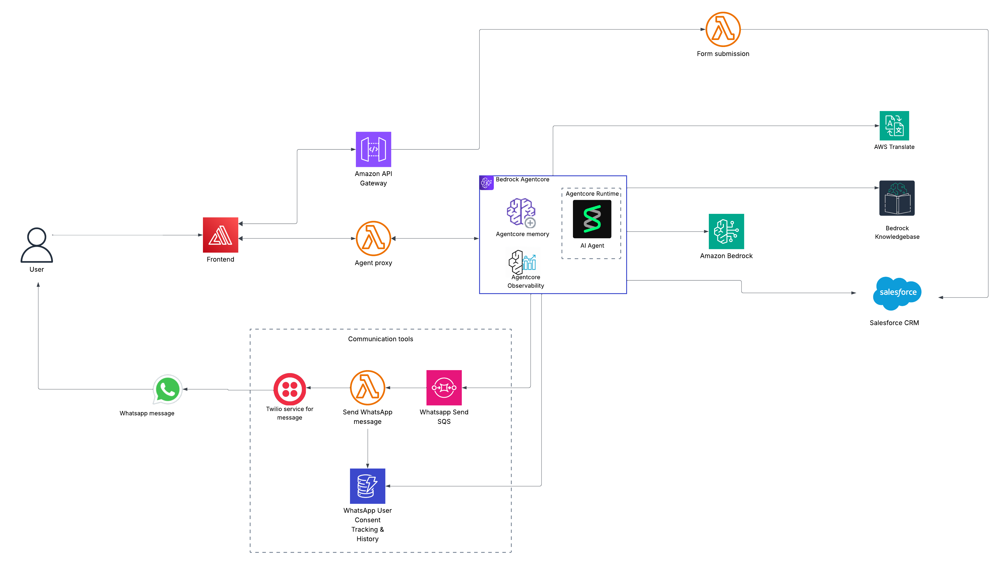

# Architecture Overview

## Architecture Diagram

---

## End-to-End Flow

- **Visit & Chat:** Prospective students engage through the Next.js frontend (hosted on Amplify) to converse with Nemo after submitting the inquiry form.
- **Streamed Responses:** The frontend invokes the Agent Proxy Lambda Function URL, which streams messages to and from the Bedrock AgentCore runtime where Nemo executes.
- **Knowledge Retrieval:** When students ask for specific details, Nemo calls `retrieve_university_info` to search the Bedrock Knowledge Base backed by S3.
- **Advisor Handoff:** After consent, Nemo triggers `complete_advisor_handoff`, updating Salesforce leads and queuing WhatsApp follow-ups.
- **WhatsApp Follow-Up:** The `twilio-whatsapp-queue` delivers messages to `send_whatsapp_twilio.py`, which uses Twilio to notify students and records delivery status in DynamoDB.
- **Form Submissions:** The inquiry form posts to API Gateway `POST /submit`, invoking `form_submission.py` to create or update Salesforce records.
- **Session Memory:** DynamoDB `WhatsappSessions` stores short-term history for context; `WhatsAppMessageTracking` keeps message delivery logs.

## AWS Cloud Services

- **Amazon API Gateway:** endpoint for form submission.
- **AWS Lambda:**
  - `Backend/admissions-ai-agent/lambda/agent-proxy/index.js` streams chat traffic with `awslambda.streamifyResponse`.
  - `form_submission.py` handles form submissions to Salesforce.
  - `send_whatsapp_twilio` sends WhatsApp updates and logs statuses.
- **Amazon Bedrock AgentCore:** Hosts Nemo (Strands-based) with short-term memory and custom tools.
- **Amazon Bedrock AgentCore Memory:** Stores the short-term memory of the agent.
- **Amazon Bedrock AgentCore Observability:** Centralized logging and metrics for agent invocations.
- **Amazon Bedrock Knowledge Bases:** Vector search over the English knowledge base stored in S3 buckets.
- **Amazon S3:** Stores knowledge documents.
- **Amazon DynamoDB:** `WhatsappSessions` table manages context and delivery history.
- **Amazon SQS:** `twilio-whatsapp-queue` decouples advisor handoff messaging.
- **AWS Amplify Hosting:** Serves the Next.js frontend with CDN caching and environment management.
- **Amazon ECR:** Store and build the Nemo container image during `agentcore launch` deployments.
- **Amazon CloudWatch:** Centralized logging and metrics for Lambdas, queues, and agent invocations.

## Nemo Agent & Tools

- **Framework:** Strands Agent orchestrating `Anthropic Claude Sonnet 4.5` via Bedrock.
- **Tools:** `retrieve_university_info`, `complete_advisor_handoff`, `translate_text`, Salesforce utilities, Twilio integration, and session helpers.

## Deployment & Automation

- **Infrastructure as Code:** 
  -`Backend/admissions-ai-agent/lib/admissions-agent-stack.ts` defines resources with AWS CDK for main backend stack.
  - `Backend/admissions-ai-agent/lib/amplify-hosting-stack.ts` defines resources with AWS CDK for Amplify hosting stack.
- **Deployment Scripts:**
  - `deploy-scripts/frontend-amplify-deploy.sh` builds the Next.js app and uploads artifacts to Amplify.
  - `admissions-ai-agent/AgentCore/scripts/launch_agent.sh` builds and deploys the agent to Bedrock AgentCore after agent has been configured.
- **Agent Lifecycle:** `agentcore configure` captures execution role, ECR repo, and memory settings; `agentcore launch` builds and deploys the runtime, producing the ARN consumed by the proxy Lambda.

## Integrations 

- **Salesforce:** Lambda environment variables supply credentials; helper modules perform lead search, creation, status updates, and task logging.
- **Twilio WhatsApp:** Packaged via Lambda layer; credentials reside in environment variables; delivery status is persisted to DynamoDB.
